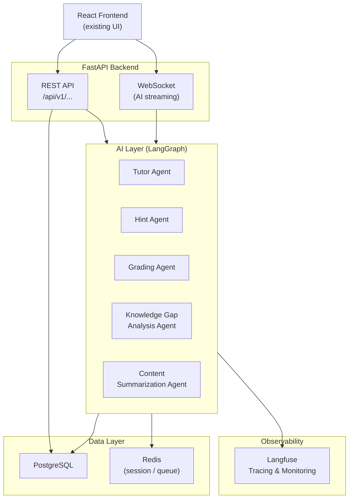
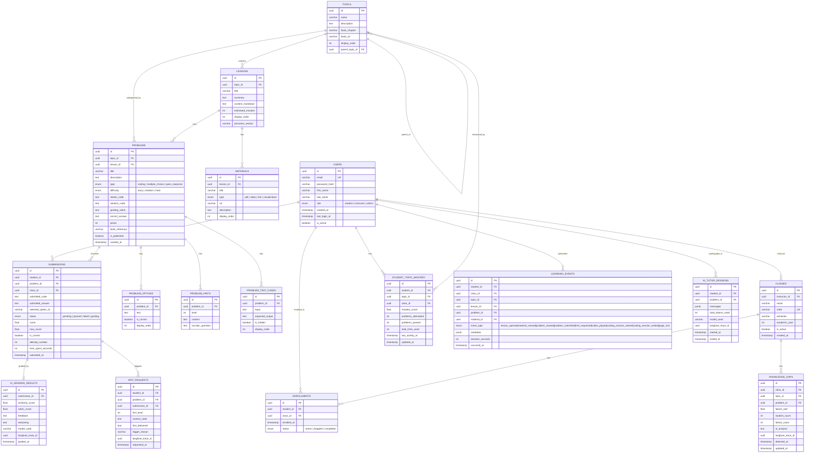
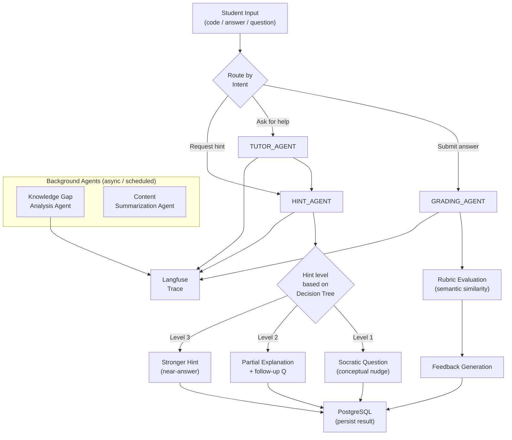

# ThinkCode — Backend Architecture & Database Design

> **Scope:** Backend only. The existing React/Vite frontend UI is not modified.
> **Stack:** Python · FastAPI · PostgreSQL · LangGraph · Langfuse

---

## 1. System Overview



---

## 2. ER Diagram



---

## 3. Full PostgreSQL Schema

```sql
-- ─────────────────────────────────────────────────────────────
-- EXTENSIONS
-- ─────────────────────────────────────────────────────────────
CREATE EXTENSION IF NOT EXISTS "uuid-ossp";
CREATE EXTENSION IF NOT EXISTS "pg_trgm"; -- for text search

-- ─────────────────────────────────────────────────────────────
-- ENUMS
-- ─────────────────────────────────────────────────────────────
CREATE TYPE user_role AS ENUM ('student', 'instructor', 'admin');
CREATE TYPE enrollment_status AS ENUM ('active', 'dropped', 'completed');
CREATE TYPE problem_type AS ENUM ('coding', 'multiple_choice', 'open_response');
CREATE TYPE difficulty_level AS ENUM ('easy', 'medium', 'hard');
CREATE TYPE submission_status AS ENUM ('pending', 'passed', 'failed', 'grading');
CREATE TYPE material_type AS ENUM ('pdf', 'video', 'link', 'visualization');
CREATE TYPE event_type AS ENUM (
  'lesson_opened', 'material_viewed', 'problem_started',
  'problem_submitted', 'hint_requested', 'video_played',
  'coding_session_started', 'coding_session_ended', 'page_visit'
);

-- ─────────────────────────────────────────────────────────────
-- USERS
-- ─────────────────────────────────────────────────────────────
CREATE TABLE users (
  id              UUID PRIMARY KEY DEFAULT uuid_generate_v4(),
  email           VARCHAR(255) UNIQUE NOT NULL,
  password_hash   VARCHAR(255) NOT NULL,
  first_name      VARCHAR(100) NOT NULL,
  last_name       VARCHAR(100) NOT NULL,
  role            user_role NOT NULL DEFAULT 'student',
  is_active       BOOLEAN NOT NULL DEFAULT TRUE,
  last_login_at   TIMESTAMP WITH TIME ZONE,
  created_at      TIMESTAMP WITH TIME ZONE DEFAULT NOW()
);

-- ─────────────────────────────────────────────────────────────
-- CLASSES & ENROLLMENTS
-- ─────────────────────────────────────────────────────────────
CREATE TABLE classes (
  id              UUID PRIMARY KEY DEFAULT uuid_generate_v4(),
  instructor_id   UUID NOT NULL REFERENCES users(id) ON DELETE RESTRICT,
  name            VARCHAR(255) NOT NULL,
  code            VARCHAR(50) UNIQUE NOT NULL,   -- e.g. "COS226-F2025"
  semester        VARCHAR(50),                   -- e.g. "Fall 2025"
  academic_year   INT,
  is_active       BOOLEAN NOT NULL DEFAULT TRUE,
  created_at      TIMESTAMP WITH TIME ZONE DEFAULT NOW()
);

CREATE TABLE enrollments (
  id              UUID PRIMARY KEY DEFAULT uuid_generate_v4(),
  student_id      UUID NOT NULL REFERENCES users(id) ON DELETE CASCADE,
  class_id        UUID NOT NULL REFERENCES classes(id) ON DELETE CASCADE,
  status          enrollment_status NOT NULL DEFAULT 'active',
  enrolled_at     TIMESTAMP WITH TIME ZONE DEFAULT NOW(),
  UNIQUE (student_id, class_id)
);

-- ─────────────────────────────────────────────────────────────
-- COURSE STRUCTURE
-- ─────────────────────────────────────────────────────────────
CREATE TABLE topics (
  id              UUID PRIMARY KEY DEFAULT uuid_generate_v4(),
  name            VARCHAR(255) NOT NULL,
  description     TEXT,
  book_chapter    VARCHAR(100),   -- e.g. "Chapter 2: Sorting"
  book_url        VARCHAR(500),   -- Princeton book section URL
  display_order   INT NOT NULL DEFAULT 0,
  parent_topic_id UUID REFERENCES topics(id) ON DELETE SET NULL
);

CREATE TABLE lessons (
  id                UUID PRIMARY KEY DEFAULT uuid_generate_v4(),
  topic_id          UUID NOT NULL REFERENCES topics(id) ON DELETE CASCADE,
  title             VARCHAR(255) NOT NULL,
  summary           TEXT,
  content_markdown  TEXT,
  estimated_minutes INT DEFAULT 15,
  display_order     INT NOT NULL DEFAULT 0,
  princeton_section VARCHAR(100)  -- e.g. "2.1 Elementary Sorts"
);

CREATE TABLE materials (
  id              UUID PRIMARY KEY DEFAULT uuid_generate_v4(),
  lesson_id       UUID NOT NULL REFERENCES lessons(id) ON DELETE CASCADE,
  title           VARCHAR(255) NOT NULL,
  type            material_type NOT NULL,
  url             VARCHAR(1000) NOT NULL,
  description     TEXT,
  display_order   INT NOT NULL DEFAULT 0
);

-- ─────────────────────────────────────────────────────────────
-- PROBLEMS
-- ─────────────────────────────────────────────────────────────
CREATE TABLE problems (
  id               UUID PRIMARY KEY DEFAULT uuid_generate_v4(),
  topic_id         UUID NOT NULL REFERENCES topics(id) ON DELETE RESTRICT,
  lesson_id        UUID REFERENCES lessons(id) ON DELETE SET NULL,
  title            VARCHAR(255) NOT NULL,
  description      TEXT NOT NULL,
  type             problem_type NOT NULL,
  difficulty       difficulty_level NOT NULL DEFAULT 'medium',
  starter_code     TEXT,
  solution_code    TEXT,          -- never sent to frontend
  grading_rubric   TEXT,          -- used by Grading Agent
  correct_answer   TEXT,          -- for MCQ / open response ground truth
  points           INT NOT NULL DEFAULT 10,
  book_reference   VARCHAR(500),
  is_published     BOOLEAN NOT NULL DEFAULT FALSE,
  created_at       TIMESTAMP WITH TIME ZONE DEFAULT NOW()
);

CREATE TABLE problem_options (
  id              UUID PRIMARY KEY DEFAULT uuid_generate_v4(),
  problem_id      UUID NOT NULL REFERENCES problems(id) ON DELETE CASCADE,
  text            TEXT NOT NULL,
  is_correct      BOOLEAN NOT NULL DEFAULT FALSE,
  display_order   INT NOT NULL DEFAULT 0
);

CREATE TABLE problem_hints (
  id                UUID PRIMARY KEY DEFAULT uuid_generate_v4(),
  problem_id        UUID NOT NULL REFERENCES problems(id) ON DELETE CASCADE,
  level             INT NOT NULL CHECK (level BETWEEN 1 AND 3),
  content           TEXT NOT NULL,
  socratic_question TEXT,         -- question to prompt student thinking
  UNIQUE (problem_id, level)
);

CREATE TABLE problem_test_cases (
  id               UUID PRIMARY KEY DEFAULT uuid_generate_v4(),
  problem_id       UUID NOT NULL REFERENCES problems(id) ON DELETE CASCADE,
  input            TEXT NOT NULL,
  expected_output  TEXT NOT NULL,
  is_hidden        BOOLEAN NOT NULL DEFAULT FALSE,
  display_order    INT NOT NULL DEFAULT 0
);

-- ─────────────────────────────────────────────────────────────
-- SUBMISSIONS
-- ─────────────────────────────────────────────────────────────
CREATE TABLE submissions (
  id                   UUID PRIMARY KEY DEFAULT uuid_generate_v4(),
  student_id           UUID NOT NULL REFERENCES users(id) ON DELETE CASCADE,
  problem_id           UUID NOT NULL REFERENCES problems(id) ON DELETE CASCADE,
  class_id             UUID NOT NULL REFERENCES classes(id) ON DELETE CASCADE,
  submitted_code       TEXT,
  submitted_answer     TEXT,
  selected_option_id   UUID REFERENCES problem_options(id) ON DELETE SET NULL,
  status               submission_status NOT NULL DEFAULT 'pending',
  score                FLOAT DEFAULT 0,
  max_score            FLOAT,
  is_correct           BOOLEAN,
  attempt_number       INT NOT NULL DEFAULT 1,
  time_spent_seconds   INT DEFAULT 0,
  submitted_at         TIMESTAMP WITH TIME ZONE DEFAULT NOW()
);

CREATE TABLE ai_grading_results (
  id                UUID PRIMARY KEY DEFAULT uuid_generate_v4(),
  submission_id     UUID NOT NULL UNIQUE REFERENCES submissions(id) ON DELETE CASCADE,
  similarity_score  FLOAT,        -- 0.0–1.0 semantic similarity
  rubric_score      FLOAT,        -- 0.0–1.0 rubric match
  feedback          TEXT NOT NULL,
  reasoning         TEXT,         -- chain-of-thought (stored for research)
  model_used        VARCHAR(100),
  langfuse_trace_id VARCHAR(255), -- link to Langfuse trace
  graded_at         TIMESTAMP WITH TIME ZONE DEFAULT NOW()
);

-- ─────────────────────────────────────────────────────────────
-- AI INTERACTIONS
-- ─────────────────────────────────────────────────────────────
CREATE TABLE hint_requests (
  id                UUID PRIMARY KEY DEFAULT uuid_generate_v4(),
  student_id        UUID NOT NULL REFERENCES users(id) ON DELETE CASCADE,
  problem_id        UUID NOT NULL REFERENCES problems(id) ON DELETE CASCADE,
  submission_id     UUID REFERENCES submissions(id) ON DELETE SET NULL,
  hint_level        INT NOT NULL CHECK (hint_level BETWEEN 1 AND 3),
  context_code      TEXT,
  hint_delivered    TEXT NOT NULL,
  trigger_reason    VARCHAR(255),  -- e.g. "3rd_failed_attempt"
  langfuse_trace_id VARCHAR(255),
  requested_at      TIMESTAMP WITH TIME ZONE DEFAULT NOW()
);

CREATE TABLE ai_tutor_sessions (
  id                UUID PRIMARY KEY DEFAULT uuid_generate_v4(),
  student_id        UUID NOT NULL REFERENCES users(id) ON DELETE CASCADE,
  problem_id        UUID REFERENCES problems(id) ON DELETE SET NULL,
  messages          JSONB NOT NULL DEFAULT '[]',
  total_tokens_used INT DEFAULT 0,
  model_used        VARCHAR(100),
  langfuse_trace_id VARCHAR(255),
  started_at        TIMESTAMP WITH TIME ZONE DEFAULT NOW(),
  ended_at          TIMESTAMP WITH TIME ZONE
);

-- ─────────────────────────────────────────────────────────────
-- ANALYTICS
-- ─────────────────────────────────────────────────────────────
CREATE TABLE student_topic_mastery (
  id                   UUID PRIMARY KEY DEFAULT uuid_generate_v4(),
  student_id           UUID NOT NULL REFERENCES users(id) ON DELETE CASCADE,
  topic_id             UUID NOT NULL REFERENCES topics(id) ON DELETE CASCADE,
  class_id             UUID NOT NULL REFERENCES classes(id) ON DELETE CASCADE,
  mastery_score        FLOAT NOT NULL DEFAULT 0 CHECK (mastery_score BETWEEN 0 AND 100),
  problems_attempted   INT NOT NULL DEFAULT 0,
  problems_passed      INT NOT NULL DEFAULT 0,
  total_hints_used     INT NOT NULL DEFAULT 0,
  last_activity_at     TIMESTAMP WITH TIME ZONE,
  updated_at           TIMESTAMP WITH TIME ZONE DEFAULT NOW(),
  UNIQUE (student_id, topic_id, class_id)
);

CREATE TABLE knowledge_gaps (
  id                UUID PRIMARY KEY DEFAULT uuid_generate_v4(),
  class_id          UUID NOT NULL REFERENCES classes(id) ON DELETE CASCADE,
  topic_id          UUID NOT NULL REFERENCES topics(id) ON DELETE CASCADE,
  problem_id        UUID REFERENCES problems(id) ON DELETE SET NULL,
  failure_rate      FLOAT NOT NULL,       -- 0.0–1.0
  student_count     INT NOT NULL,
  failure_count     INT NOT NULL,
  ai_analysis       TEXT,                 -- Gap Analysis Agent summary
  langfuse_trace_id VARCHAR(255),
  detected_at       TIMESTAMP WITH TIME ZONE DEFAULT NOW(),
  updated_at        TIMESTAMP WITH TIME ZONE DEFAULT NOW()
);

-- ─────────────────────────────────────────────────────────────
-- LEARNING EVENTS (research log)
-- ─────────────────────────────────────────────────────────────
CREATE TABLE learning_events (
  id               UUID PRIMARY KEY DEFAULT uuid_generate_v4(),
  student_id       UUID NOT NULL REFERENCES users(id) ON DELETE CASCADE,
  class_id         UUID REFERENCES classes(id) ON DELETE SET NULL,
  topic_id         UUID REFERENCES topics(id) ON DELETE SET NULL,
  lesson_id        UUID REFERENCES lessons(id) ON DELETE SET NULL,
  problem_id       UUID REFERENCES problems(id) ON DELETE SET NULL,
  material_id      UUID REFERENCES materials(id) ON DELETE SET NULL,
  event_type       event_type NOT NULL,
  metadata         JSONB DEFAULT '{}',   -- flexible extra data
  duration_seconds INT,
  occurred_at      TIMESTAMP WITH TIME ZONE DEFAULT NOW()
) PARTITION BY RANGE (occurred_at);

-- Monthly partitions (create for each month in production)
CREATE TABLE learning_events_2025_09
  PARTITION OF learning_events
  FOR VALUES FROM ('2025-09-01') TO ('2025-10-01');

CREATE TABLE learning_events_2025_10
  PARTITION OF learning_events
  FOR VALUES FROM ('2025-10-01') TO ('2025-11-01');

-- (continue for each month)
```

---

## 4. Indexes for Analytics Queries

```sql
-- ── User lookups ────────────────────────────────────────────────
CREATE INDEX idx_users_email ON users(email);
CREATE INDEX idx_users_role ON users(role);

-- ── Enrollment queries ───────────────────────────────────────────
CREATE INDEX idx_enrollments_class ON enrollments(class_id);
CREATE INDEX idx_enrollments_student ON enrollments(student_id);
CREATE INDEX idx_enrollments_status ON enrollments(class_id, status);

-- ── Problem discovery ───────────────────────────────────────────
CREATE INDEX idx_problems_topic ON problems(topic_id);
CREATE INDEX idx_problems_type_difficulty ON problems(type, difficulty);
CREATE INDEX idx_problems_published ON problems(is_published) WHERE is_published = TRUE;

-- ── Submissions (most queried table) ────────────────────────────
CREATE INDEX idx_submissions_student ON submissions(student_id);
CREATE INDEX idx_submissions_problem ON submissions(problem_id);
CREATE INDEX idx_submissions_class ON submissions(class_id);
CREATE INDEX idx_submissions_student_problem ON submissions(student_id, problem_id);
CREATE INDEX idx_submissions_class_date ON submissions(class_id, submitted_at DESC);
CREATE INDEX idx_submissions_correctness ON submissions(problem_id, is_correct);

-- ── Mastery (dashboard queries) ─────────────────────────────────
CREATE INDEX idx_mastery_student_class ON student_topic_mastery(student_id, class_id);
CREATE INDEX idx_mastery_topic_score ON student_topic_mastery(topic_id, mastery_score DESC);

-- ── Knowledge gaps (instructor dashboard) ───────────────────────
CREATE INDEX idx_gaps_class ON knowledge_gaps(class_id, failure_rate DESC);
CREATE INDEX idx_gaps_topic ON knowledge_gaps(topic_id);

-- ── Learning events (research queries) ──────────────────────────
CREATE INDEX idx_events_student ON learning_events(student_id, occurred_at DESC);
CREATE INDEX idx_events_class_type ON learning_events(class_id, event_type);
CREATE INDEX idx_events_problem ON learning_events(problem_id) WHERE problem_id IS NOT NULL;

-- ── Hint analysis ───────────────────────────────────────────────
CREATE INDEX idx_hints_student_problem ON hint_requests(student_id, problem_id);
CREATE INDEX idx_hints_level ON hint_requests(problem_id, hint_level);

-- ── Full-text search on problems ────────────────────────────────
CREATE INDEX idx_problems_text_search
  ON problems USING GIN (to_tsvector('english', title || ' ' || description));
```

---

## 5. Key Analytics Queries

### Class percentile ranking
```sql
WITH student_scores AS (
  SELECT
    s.student_id,
    u.first_name || ' ' || u.last_name AS student_name,
    SUM(s.score) AS total_score,
    PERCENT_RANK() OVER (ORDER BY SUM(s.score)) AS percentile
  FROM submissions s
  JOIN users u ON u.id = s.student_id
  WHERE s.class_id = :class_id AND s.is_correct = TRUE
  GROUP BY s.student_id, u.first_name, u.last_name
)
SELECT * FROM student_scores ORDER BY percentile DESC;
```

### Knowledge gap detection
```sql
SELECT
  p.id AS problem_id,
  p.title,
  t.name AS topic,
  COUNT(*) AS total_attempts,
  SUM(CASE WHEN s.is_correct = FALSE THEN 1 ELSE 0 END) AS failures,
  ROUND(
    100.0 * SUM(CASE WHEN s.is_correct = FALSE THEN 1 ELSE 0 END) / COUNT(*), 1
  ) AS failure_rate_pct
FROM submissions s
JOIN problems p ON p.id = s.problem_id
JOIN topics t ON t.id = p.topic_id
WHERE s.class_id = :class_id
GROUP BY p.id, p.title, t.name
HAVING COUNT(*) >= 5
ORDER BY failure_rate_pct DESC
LIMIT 20;
```

### Student weak topics
```sql
SELECT
  t.name AS topic,
  m.mastery_score,
  m.problems_attempted,
  m.problems_passed,
  m.total_hints_used
FROM student_topic_mastery m
JOIN topics t ON t.id = m.topic_id
WHERE m.student_id = :student_id
  AND m.class_id = :class_id
ORDER BY m.mastery_score ASC
LIMIT 5;
```

### Hint usage by problem
```sql
SELECT
  p.title,
  hr.hint_level,
  COUNT(*) AS requests,
  COUNT(DISTINCT hr.student_id) AS unique_students
FROM hint_requests hr
JOIN problems p ON p.id = hr.problem_id
JOIN submissions sub ON sub.problem_id = p.id
WHERE sub.class_id = :class_id
GROUP BY p.title, hr.hint_level
ORDER BY requests DESC;
```

---

## 6. Seed Data Strategy — Princeton Algorithms

### Topic hierarchy from the book

```python
PRINCETON_TOPICS = [
    # (name, book_chapter, book_url, order)
    ("Fundamentals",        "Chapter 1", "https://algs4.cs.princeton.edu/10fundamentals/", 1),
    ("Union-Find",          "1.5",       "https://algs4.cs.princeton.edu/15uf/",           2),
    ("Sorting",             "Chapter 2", "https://algs4.cs.princeton.edu/20sorting/",      3),
    ("Elementary Sorts",    "2.1",       "https://algs4.cs.princeton.edu/21elementary/",   4),
    ("Mergesort",           "2.2",       "https://algs4.cs.princeton.edu/22mergesort/",    5),
    ("Quicksort",           "2.3",       "https://algs4.cs.princeton.edu/23quicksort/",    6),
    ("Priority Queues",     "2.4",       "https://algs4.cs.princeton.edu/24pq/",           7),
    ("Searching",           "Chapter 3", "https://algs4.cs.princeton.edu/30searching/",    8),
    ("Binary Search Trees", "3.2",       "https://algs4.cs.princeton.edu/32bst/",          9),
    ("Balanced BSTs",       "3.3",       "https://algs4.cs.princeton.edu/33balanced/",     10),
    ("Hash Tables",         "3.4",       "https://algs4.cs.princeton.edu/34hash/",         11),
    ("Graphs",              "Chapter 4", "https://algs4.cs.princeton.edu/40graphs/",       12),
    ("Undirected Graphs",   "4.1",       "https://algs4.cs.princeton.edu/41graph/",        13),
    ("Directed Graphs",     "4.2",       "https://algs4.cs.princeton.edu/42digraph/",      14),
    ("Minimum Spanning Trees","4.3",     "https://algs4.cs.princeton.edu/43mst/",          15),
    ("Shortest Paths",      "4.4",       "https://algs4.cs.princeton.edu/44sp/",           16),
    ("Strings",             "Chapter 5", "https://algs4.cs.princeton.edu/50strings/",      17),
    ("Dynamic Programming", "Appendix",  "https://algs4.cs.princeton.edu/",               18),
]
```

### Seed script structure

```
scripts/
├── seed/
│   ├── __init__.py
│   ├── 01_users.py          # instructors + 100 students
│   ├── 02_classes.py        # COS226-F2025
│   ├── 03_topics.py         # Princeton Algorithms topics
│   ├── 04_lessons.py        # lesson per chapter section
│   ├── 05_materials.py      # Princeton visualizations + PDFs
│   ├── 06_problems.py       # 10+ problems per topic
│   ├── 07_hints.py          # 3-level hints per problem
│   ├── 08_submissions.py    # synthetic student attempts
│   └── 09_events.py         # synthetic learning events
```

### Problem seed example

```python
QUICKSORT_PROBLEMS = [
    {
        "title": "QuickSort Worst Case",
        "type": "open_response",
        "difficulty": "medium",
        "description": "Explain the worst-case time complexity of QuickSort and when it occurs.",
        "grading_rubric": """
            Score 1.0: Mentions O(n²), pivot selection on already sorted input,
                       and partition imbalance.
            Score 0.7: Mentions O(n²) but incomplete explanation.
            Score 0.4: Vague mention of slow cases without technical depth.
            Score 0.0: Incorrect or no meaningful answer.
        """,
        "hints": [
            {"level": 1, "content": "Think about what happens to the partition when the array is already sorted.",
             "socratic_question": "What does the pivot choice look like when the array is nearly sorted?"},
            {"level": 2, "content": "Consider the recursion tree depth when every partition creates a 1:n-1 split.",
             "socratic_question": "How many recursive calls happen if one partition always has 0 elements?"},
            {"level": 3, "content": "The worst case is O(n²) — occurs when the pivot is always the smallest or largest element, causing n levels of recursion.",
             "socratic_question": None},
        ],
        "book_reference": "Sedgewick & Wayne — 2.3 Quicksort"
    },
    {
        "title": "Implement Partition",
        "type": "coding",
        "difficulty": "hard",
        "starter_code": "def partition(arr, lo, hi):\n    # your code here\n    pass",
        "solution_code": "def partition(arr, lo, hi):\n    pivot = arr[lo]\n    i, j = lo + 1, hi\n    while True:\n        while i <= hi and arr[i] < pivot: i += 1\n        while j > lo and arr[j] > pivot: j -= 1\n        if i >= j: break\n        arr[i], arr[j] = arr[j], arr[i]\n    arr[lo], arr[j] = arr[j], arr[lo]\n    return j",
        "book_reference": "Sedgewick & Wayne — 2.3 Quicksort, Program 2.3.1"
    }
]
```

---

## 7. LangGraph Agent Architecture

### Agent graph structure



### Hint Decision Tree

```python
def decide_hint_level(student_id: str, problem_id: str, db) -> int:
    """
    Decision tree for hint escalation.
    Returns: hint level 1, 2, or 3
    """
    # Count failed attempts on this problem
    attempts = db.query("""
        SELECT COUNT(*) FROM submissions
        WHERE student_id = %s AND problem_id = %s AND is_correct = FALSE
    """, [student_id, problem_id]).scalar()

    # Count hints already given
    hints_given = db.query("""
        SELECT COALESCE(MAX(hint_level), 0) FROM hint_requests
        WHERE student_id = %s AND problem_id = %s
    """, [student_id, problem_id]).scalar()

    # Decision logic
    if attempts == 0:
        return 1  # First time stuck → gentle Socratic nudge
    elif attempts < 3 or hints_given < 2:
        return 2  # Struggling → partial explanation
    else:
        return 3  # Repeatedly failing → stronger hint (but no full answer)
```

### LangGraph agent code structure

```
backend/
├── agents/
│   ├── __init__.py
│   ├── graph.py              # LangGraph StateGraph definition
│   ├── state.py              # AgentState TypedDict
│   ├── router.py             # Intent classification node
│   ├── tutor_agent.py        # Conversational tutor node
│   ├── hint_agent.py         # Hint generation node
│   ├── grading_agent.py      # Open response grading node
│   ├── gap_analysis_agent.py # Class-level gap analysis (scheduled)
│   └── content_agent.py      # Princeton content summarization
├── api/
│   ├── routers/
│   │   ├── auth.py
│   │   ├── students.py
│   │   ├── problems.py
│   │   ├── submissions.py
│   │   ├── analytics.py
│   │   └── instructor.py
│   └── main.py               # FastAPI app
├── db/
│   ├── models.py             # SQLAlchemy models
│   ├── session.py            # DB session
│   └── migrations/           # Alembic
├── services/
│   ├── mastery_service.py    # Update student_topic_mastery
│   ├── event_service.py      # Log learning_events
│   └── analytics_service.py  # Aggregation queries
└── scripts/seed/             # Seed scripts
```

### Agent State definition

```python
from typing import TypedDict, Optional, List

class AgentState(TypedDict):
    # Input
    student_id: str
    problem_id: str
    class_id: str
    user_message: str
    submitted_code: Optional[str]
    submitted_answer: Optional[str]

    # Context (fetched from DB)
    problem: dict             # problem row
    attempt_count: int
    previous_hints: List[int] # hint levels already delivered

    # Intent
    intent: str               # "tutor" | "hint" | "grade"
    hint_level: Optional[int]

    # Output
    response: Optional[str]
    grading_result: Optional[dict]
    hint_delivered: Optional[str]

    # Observability
    langfuse_trace_id: Optional[str]
```

---

## 8. Langfuse Integration

### What to trace

| Agent | What Langfuse captures |
|---|---|
| Tutor Agent | Full conversation, tokens, latency |
| Hint Agent | Hint level, decision tree path, hint text |
| Grading Agent | Rubric prompt, LLM output, final score |
| Gap Analysis Agent | Input data, LLM analysis, output summary |
| Content Agent | Princeton URL processed, summary generated |

### Integration pattern

```python
from langfuse import Langfuse
from langfuse.decorators import observe, langfuse_context

langfuse = Langfuse(
    public_key=os.environ["LANGFUSE_PUBLIC_KEY"],
    secret_key=os.environ["LANGFUSE_SECRET_KEY"],
    host=os.environ["LANGFUSE_HOST"],
)

@observe(name="hint_agent")
async def run_hint_agent(state: AgentState) -> AgentState:
    langfuse_context.update_current_trace(
        user_id=state["student_id"],
        session_id=f"{state['student_id']}-{state['problem_id']}",
        metadata={
            "problem_id": state["problem_id"],
            "hint_level": state["hint_level"],
            "attempt_count": state["attempt_count"],
        }
    )
    # ... agent logic ...
    trace_id = langfuse_context.get_current_trace_id()

    # Store trace_id in DB for cross-referencing
    await db.execute(
        "INSERT INTO hint_requests (langfuse_trace_id, ...) VALUES (%s, ...)",
        [trace_id, ...]
    )
    return state

@observe(name="grading_agent")
async def run_grading_agent(state: AgentState) -> AgentState:
    langfuse_context.update_current_trace(
        user_id=state["student_id"],
        tags=["grading", state["problem_id"]],
    )
    # LLM call is automatically captured
    # ...
    return state
```

### Langfuse dashboard custom events

```python
# Track custom analytics in Langfuse
langfuse.create_score(
    trace_id=trace_id,
    name="grading_accuracy",
    value=rubric_score,     # 0.0–1.0
    comment="Rubric match score"
)

langfuse.create_score(
    trace_id=trace_id,
    name="hint_level",
    value=hint_level,       # 1, 2, or 3
    comment=f"Trigger: {trigger_reason}"
)
```

---

## 9. Backend API Surface (matching existing UI)

| Method | Endpoint | Purpose |
|--------|----------|---------|
| POST | `/api/v1/auth/login` | JWT login |
| GET | `/api/v1/students/{id}/dashboard` | Student dashboard data |
| GET | `/api/v1/students/{id}/mastery` | Topic mastery scores |
| GET | `/api/v1/students/{id}/analytics` | Student analytics page |
| GET | `/api/v1/topics` | All topics with lessons |
| GET | `/api/v1/topics/{id}/problems` | Problems for a topic |
| GET | `/api/v1/lessons/{id}` | Lesson + materials |
| GET | `/api/v1/problems/{id}` | Problem detail |
| POST | `/api/v1/submissions` | Submit answer |
| POST | `/api/v1/submissions/{id}/hint` | Request a hint |
| POST | `/api/v1/ai/tutor` | Send chat message |
| GET | `/api/v1/instructor/{class_id}/dashboard` | Instructor dashboard |
| GET | `/api/v1/instructor/{class_id}/gaps` | Knowledge gaps |
| GET | `/api/v1/instructor/{class_id}/students` | Student ranking |
| POST | `/api/v1/events` | Log a learning event |

---

## 10. Implementation Priority Order

> [!IMPORTANT]
> Follow this order — each phase depends on the previous.

```
Phase 1 — Database Foundation (Week 1)
  ├── Run PostgreSQL schema migrations (Alembic)
  ├── Seed topics, lessons, materials (Princeton content)
  └── Seed 5+ problems per topic with hints

Phase 2 — Core API (Week 1–2)
  ├── FastAPI app setup + JWT auth
  ├── /topics, /lessons, /problems endpoints
  ├── /submissions endpoint (stores to DB)
  └── /events endpoint (learning event logging)

Phase 3 — Analytics Queries (Week 2)
  ├── Student dashboard data endpoint
  ├── Mastery calculation + update trigger
  ├── Instructor dashboard aggregations
  └── Knowledge gap detection query

Phase 4 — AI Layer (Week 3)
  ├── LangGraph graph definition + state
  ├── Grading Agent (open response scoring)
  ├── Hint Agent + decision tree
  └── Tutor Agent (conversational)

Phase 5 — Observability (Week 3–4)
  ├── Langfuse decorators on all agents
  ├── Store trace IDs in DB
  └── Custom scores for grading + hints

Phase 6 — Background Agents (Week 4)
  ├── Knowledge Gap Analysis Agent (nightly)
  └── Content Summarization Agent (on-demand)
```
