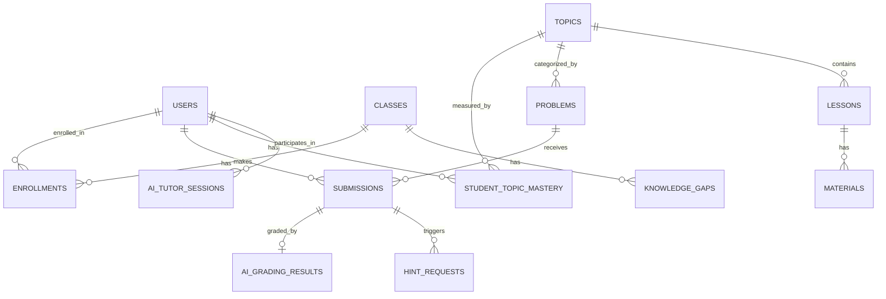

# ThinkCode — AI-Powered Learning Analytics Platform

> An intelligent learning environment for Princeton Algorithms (Sedgewick 4th Ed.) with embedded AI tutoring, adaptive hints, and real-time analytics.

---

## 🚀 Quick Start

```bash
# Clone and start all services with Docker
git clone https://github.com/Asyaberk/thinkcode.git
cd thinkcode---learning-analytics-platform

cp .env.example .env    # fill in DB credentials + OPENAI_API_KEY

docker compose up -d --build
```

| Service | URL |
|---|---|
| Frontend | http://localhost:8080 |
| Backend API Docs | http://localhost:8000/api/docs |
| pgAdmin | http://localhost:5050 |

**Run database migrations + seed on first start:**
```bash
docker exec -it thinkcode-backend bash -c "alembic upgrade head && PYTHONPATH=. python scripts/seed/run_all.py"
```

---

## 🔑 Demo Credentials

| Role | Email | Password |
|---|---|---|
| Instructor | `instructor@thinkcode.edu` | `Instructor123!` |
| Student | `emma.johnson@thinkcode.edu` | `Student123!` |
| Student | `liam.wilson@thinkcode.edu` | `Student123!` |

---

## 🧱 Tech Stack

| Layer | Technology |
|---|---|
| **Frontend** | React 18 + Vite + TypeScript |
| **Styling** | Vanilla CSS + Framer Motion + Recharts |
| **Backend** | Python 3.12 + FastAPI + Uvicorn |
| **Database** | PostgreSQL 15 + SQLAlchemy + Alembic |
| **AI** | LangGraph + LangChain + OpenAI `gpt-4o-mini` |
| **Observability** | Langfuse (optional) |
| **Auth** | JWT Bearer tokens |
| **Deployment** | Docker + Docker Compose (4 containers) |

---

## 📺 Application Pages

### Student-Facing

| Page | Description |
|---|---|
| **Login** | JWT-based auth, role-aware redirect |
| **Dashboard** | Topic list with mastery scores, streak, overall progress |
| **Problems** | Filterable question list by topic with difficulty badges |
| **Learning** | Markdown lesson content + PDF / video / link materials |
| **Question** | Solve MCQ / coding / open-response questions with AI chat |
| **Analytics** | Personal analytics: accuracy charts, daily activity, hint usage, AI insight, class ranking |

### Instructor-Facing

| Page | Description |
|---|---|
| **Instructor Dashboard** | Class overview: mastery heatmap, knowledge gap detection, student ranking, AI gap analysis report |

---

## 🤖 AI Agents

| Agent | File | Trigger | Model |
|---|---|---|---|
| **Socratic Tutor** | `ai/dialog_graph.py` | Student sends chat message → `/tutor/chat` | gpt-4o-mini |
| **Grading Agent** | `ai/grading.py` | Coding / open-response submission | gpt-4o-mini |
| **Hint Agent** | `ai/hint.py` | Student clicks Hint button | gpt-4o-mini |
| **Gap Analysis** | `ai/gap_analysis.py` | Instructor clicks Generate Report | gpt-4o-mini |
| **Content Generator** | `ai/content.py` | Lesson content generation endpoint | gpt-4o-mini |

### Socratic Tutor — Dialog Flow

```
Student message
      │
classify_intent()
      │
  ┌───┴──────────────────────┐
hint      explain    grade    socratic
  │           │         │         │
  ▼           ▼         ▼         ▼
Kademeli   Error     Cevap    Soru sor
 ipucu    açıkla   değerlendir (cevap verme)
```

### Hint System — Level Logic

| Condition | Level | Response |
|---|---|---|
| First attempt | 1 | Socratic question |
| 2–3 attempts or < 2 hints given | 2 | Partial explanation + question |
| 3+ attempts | 3 | Strong hint (near-answer, no code) |

---

## 🗄️ Database Schema

### Tables

| Table | Purpose |
|---|---|
| `users` | Students, instructors, admins |
| `classes` + `enrollments` | Class management + student membership |
| `topics` | Hierarchical algorithm topics (Sedgewick chapters) |
| `lessons` + `materials` | Markdown content + PDF/video links |
| `problems` + `problem_options` | MCQ, coding, open-response problems |
| `problem_hints` | 3-level hints per problem |
| `submissions` | Every student answer attempt |
| `ai_grading_results` | GPT grading output + feedback |
| `hint_requests` | Every hint delivered to a student |
| `ai_tutor_sessions` | Full chat history per problem session |
| `student_topic_mastery` | Pre-aggregated mastery score per student/topic |
| `knowledge_gaps` | Class-level problem difficulty detected by AI |
| `learning_events` | Append-only event log (page views, video plays etc.) |

### Mastery Score Calculation

```
mastery_score = 100 × (problems_passed / problems_attempted)

CRITICAL: Only the LATEST attempt per problem counts.
          Re-doing a problem incorrectly lowers the score.
```

### ER Diagram



---

## 🔌 Active API Endpoints

### Auth
| Method | Endpoint | Description |
|---|---|---|
| POST | `/api/v1/auth/login` | JWT login |
| GET | `/api/v1/auth/me` | Current user info |

### Content
| Method | Endpoint | Description |
|---|---|---|
| GET | `/api/v1/topics` | All topics (hierarchical) |
| GET | `/api/v1/topics/{id}/lessons` | Lessons for a topic |
| GET | `/api/v1/lessons/{id}` | Lesson detail + materials |
| GET | `/api/v1/problems?topic_id=` | Problems by topic |

### Student Activity
| Method | Endpoint | Description |
|---|---|---|
| POST | `/api/v1/submissions` | Submit an answer |
| GET | `/api/v1/submissions/me/solved-problem-ids` | Solved problem IDs |
| POST | `/api/v1/submissions/{id}/hint` | Request AI hint |
| POST | `/api/v1/tutor/chat` | AI Socratic tutor message |

### Analytics (Student)
| Method | Endpoint | Description |
|---|---|---|
| GET | `/api/v1/analytics/me/dashboard` | Summary stats + mastery |
| GET | `/api/v1/analytics/me/mastery` | Per-topic mastery detail |
| GET | `/api/v1/analytics/me/progress` | Daily activity (last 30 days) |
| GET | `/api/v1/analytics/me/ai-insight` | GPT-generated performance insight |
| GET | `/api/v1/analytics/me/class-distribution` | Class score distribution |
| GET | `/api/v1/analytics/me/streak` | Study streak (days) |

### Instructor
| Method | Endpoint | Description |
|---|---|---|
| GET | `/api/v1/instructor/me/class` | Instructor's class info |
| GET | `/api/v1/instructor/{class_id}/dashboard` | Full class analytics |
| GET | `/api/v1/instructor/{class_id}/students` | Student ranking |
| POST | `/api/v1/instructor/{class_id}/analyze-gaps` | AI gap analysis + save |

---

## 📁 Folder Structure

```
thinkcode/
├── backend/
│   ├── app/
│   │   ├── ai/                 # LangGraph AI agents
│   │   │   ├── dialog_graph.py # Socratic tutor (intent → hint/explain/grade/socratic)
│   │   │   ├── grading.py      # Open-response + coding grader
│   │   │   ├── hint.py         # 3-level adaptive hint system
│   │   │   ├── gap_analysis.py # Class knowledge gap detector
│   │   │   └── content.py      # Lesson content generator
│   │   ├── api/
│   │   │   ├── deps.py         # Auth + DB dependency injection
│   │   │   └── routers/        # auth, topics, problems, submissions,
│   │   │                       # analytics, instructor, tutor, lessons
│   │   ├── analytics/
│   │   │   └── queries.py      # Optimized SQL analytics queries
│   │   ├── core/
│   │   │   ├── config.py       # Environment variables (Settings)
│   │   │   └── security.py     # JWT encode/decode
│   │   ├── db/
│   │   │   ├── models.py       # SQLAlchemy ORM models (all 16 tables)
│   │   │   └── session.py      # PostgreSQL session factory
│   │   ├── schemas.py          # Pydantic request/response models
│   │   └── main.py             # FastAPI app + router registration
│   ├── scripts/seed/           # Database seeding scripts
│   ├── alembic/                # DB migrations
│   └── requirements.txt
│
├── frontend/
│   └── src/
│       ├── api/                # Backend API calls (auth, topics, problems, analytics, tutor, hints, instructor)
│       ├── components/         # Sidebar, ChatQuestionInterface, LessonContent, CodePlayground
│       ├── context/            # AuthContext (JWT state management)
│       ├── hooks/              # useTopics, useMastery, useSubmission, useHint, useLesson, useAuth
│       ├── pages/              # LoginPage, DashboardPage, ProblemsPage, LearningPage,
│       │                       # QuestionPage, AnalyticsPage, InstructorDashboard
│       ├── types.ts            # All TypeScript interfaces
│       └── App.tsx             # Page routing (state-based, no React Router)
│
├── docker-compose.yml          # 4 services: db, pgadmin, backend, app
├── nginx.conf                  # Reverse proxy (frontend ↔ backend)
└── .env                        # Secrets (not committed)
```

---

## 🐳 Docker Services

| Container | Image | Port |
|---|---|---|
| `thinkcode-db` | postgres:15 | 5433 |
| `thinkcode-pgadmin` | pgadmin4 | 5050 |
| `thinkcode-backend` | FastAPI (Uvicorn) | 8000 (internal) |
| `thinkcode-app` | React + Nginx | 3000 |

---

## ⚙️ Environment Variables

```env
# Database
DB_HOST=db
DB_PORT=5432
DB_USERNAME=thinkcode
DB_PASSWORD=your_password
DB_DATABASE=thinkcode

# JWT
JWT_SECRET_KEY=your-secret-key
JWT_EXPIRE_MINUTES=1440

# AI
OPENAI_API_KEY=sk-...

# Langfuse (optional — for AI tracing)
LANGFUSE_PUBLIC_KEY=
LANGFUSE_SECRET_KEY=
LANGFUSE_HOST=https://cloud.langfuse.com
```
