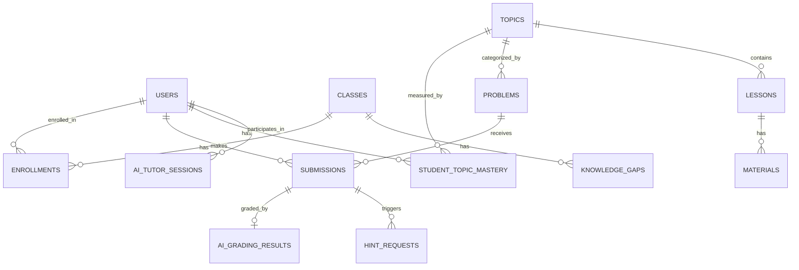

# ThinkCode — AI-Powered Learning Analytics Platform

> **ThinkCode** is a full-stack, AI-augmented learning management system built for algorithm courses (Princeton Algorithms, Sedgewick 4th Ed.). It combines an adaptive Socratic AI tutor, a 3-level hint engine, real-time learning analytics, and an instructor-facing gap analysis dashboard — all orchestrated by LangGraph agents powered by `gpt-4o-mini`.

---

## Table of Contents

1. [Project Overview](#1-project-overview)
2. [Architecture](#2-architecture)
3. [Tech Stack](#3-tech-stack)
4. [Quick Start (Docker)](#4-quick-start-docker)
5. [Environment Variables](#5-environment-variables)
6. [Database](#6-database)
7. [AI Agents](#7-ai-agents)
8. [API Reference](#8-api-reference)
9. [Frontend Pages](#9-frontend-pages)
10. [Folder Structure](#10-folder-structure)
11. [Docker Services](#11-docker-services)
12. [Development Setup (without Docker)](#12-development-setup-without-docker)
13. [Demo Credentials](#13-demo-credentials)

---

## 1. Project Overview

ThinkCode is designed around three core pillars:

| Pillar | Description |
|---|---|
| **Adaptive AI Tutoring** | A LangGraph-powered Socratic tutor that guides students without giving away answers. It classifies intent (hint / explain / grade / socratic) and responds accordingly. |
| **Learning Analytics** | Real-time dashboards for both students and instructors. Students see their mastery per topic, study streak, daily activity, and a GPT-generated personal insight. |
| **Instructor Intelligence** | Instructors get a class-wide mastery heatmap, knowledge gap detection, student ranking, and an AI-generated gap analysis report that identifies which problems the class is struggling with. |

### Who uses it?

- **Students** — solve MCQ, coding, and open-response problems; get adaptive hints; chat with the AI tutor; track their own progress.
- **Instructors** — monitor the entire class, detect knowledge gaps, upload course materials (PDF / video / links), and trigger AI content generation.

---

## 2. Architecture

```
┌─────────────────────────────────────────────────────────────┐
│                        Browser (React)                       │
│  LoginPage → CourseSelection → Dashboard → Problems →        │
│             LearningPage → QuestionPage → AnalyticsPage      │
└──────────────────────────┬──────────────────────────────────┘
                           │  HTTP / REST  (port 8080 → Nginx)
                           ▼
┌─────────────────────────────────────────────────────────────┐
│                   FastAPI Backend  (port 8000)               │
│  ┌──────────┐  ┌──────────┐  ┌────────────┐  ┌──────────┐  │
│  │  Auth    │  │ Content  │  │ Analytics  │  │Instructor│  │
│  │  Router  │  │  Router  │  │  Router    │  │  Router  │  │
│  └──────────┘  └──────────┘  └────────────┘  └──────────┘  │
│  ┌──────────────────────────────────────────────────────┐   │
│  │              AI Agent Layer (LangGraph)               │   │
│  │  Socratic Tutor │ Hint Agent │ Grader │ Gap Analyzer  │   │
│  └──────────────────────────────────────────────────────┘   │
└──────────────────────────┬──────────────────────────────────┘
                           │  SQLAlchemy (async)
                           ▼
┌─────────────────────────────────────────────────────────────┐
│               PostgreSQL 16   (port 5433 on host)            │
│  users · classes · topics · lessons · problems · submissions │
│  hint_requests · ai_tutor_sessions · knowledge_gaps · …      │
└─────────────────────────────────────────────────────────────┘
                           │  S3-compatible API
                           ▼
┌─────────────────────────────────────────────────────────────┐
│                   MinIO Object Storage                       │
│          (PDF uploads, extracted course materials)           │
└─────────────────────────────────────────────────────────────┘
```

**Request flow for a student submitting an answer:**

1. React sends `POST /api/v1/submissions` with the student's answer.
2. FastAPI validates the JWT, looks up the problem type.
3. If the problem is `coding` or `open_response`, the **Grading Agent** (`ai/grading.py`) evaluates it with GPT and stores the result in `ai_grading_results`.
4. The mastery score in `student_topic_mastery` is updated immediately (only the latest attempt counts).
5. The analytics dashboard reflects the new score on next load.

---

## 3. Tech Stack

| Layer | Technology | Version |
|---|---|---|
| **Frontend framework** | React + Vite + TypeScript | React 18 |
| **Styling** | Vanilla CSS + Framer Motion | — |
| **Charts** | Recharts | — |
| **Backend framework** | FastAPI + Uvicorn | FastAPI 0.115 |
| **Language** | Python | 3.12 |
| **ORM** | SQLAlchemy (async) | 2.0 |
| **Migrations** | Alembic | 1.14 |
| **Database** | PostgreSQL | 16-alpine |
| **AI orchestration** | LangGraph + LangChain | LangGraph 1.1 |
| **LLM** | OpenAI `gpt-4o-mini` | — |
| **AI observability** | Langfuse | 4.0 (optional) |
| **Auth** | JWT (python-jose + bcrypt) | — |
| **Object storage** | MinIO (S3-compatible) | ≥7.2 |
| **PDF parsing** | pdfplumber + pdf2image + Pillow | — |
| **OCR fallback** | GLM-OCR (external HTTP API) | — |
| **Video extraction** | yt-dlp | ≥2024.3 |
| **Containerization** | Docker + Docker Compose | — |
| **Reverse proxy** | Nginx | (inside frontend container) |

---

## 4. Quick Start (Docker)

> **Prerequisites:** Docker Desktop, Git, a valid `OPENAI_API_KEY`.

### Step 1 — Clone the repository

```bash
git clone https://github.com/Asyaberk/thinkcode.git
cd thinkcode---learning-analytics-platform
```

### Step 2 — Configure environment variables

```bash
cp .env.example .env
```

Open `.env` and fill in **at minimum**:

```env
OPENAI_API_KEY=sk-...          # Required — powers all AI agents
DB_USERNAME=thinkcode
DB_PASSWORD=choose_a_password
DB_DATABASE=thinkcode
JWT_SECRET_KEY=change-this-in-production
```

All other variables have safe defaults and are optional for local development (see [Section 5](#5-environment-variables) for the full list).

### Step 3 — Build and start all containers

```bash
docker compose up -d --build
```

This builds and starts **4 containers**: PostgreSQL, pgAdmin, FastAPI backend, and the React frontend. The first build takes 2–4 minutes.

### Step 4 — Run migrations and seed the database

This only needs to be done **once**, on the very first start:

```bash
docker exec -it thinkcode-backend bash -c \
  "alembic upgrade head && PYTHONPATH=. python scripts/seed/run_all.py"
```

What this does:
- `alembic upgrade head` — applies all database migrations and creates every table.
- `scripts/seed/run_all.py` — populates the database with demo users, course topics (all Sedgewick chapters), lessons, problems, and sample submissions so the dashboards are populated on first login.

### Step 5 — Open the app

| Service | URL | Notes |
|---|---|---|
| **Frontend** | http://localhost:8080 | Main application |
| **Backend API Docs** | http://localhost:8000/api/docs | Interactive Swagger UI |
| **pgAdmin** | http://localhost:5050 | DB browser (admin@admin.com / admin) |

### Stopping the platform

```bash
docker compose down          # stops containers, keeps data volumes
docker compose down -v       # stops containers AND deletes all data
```

### Rebuilding after a code change

```bash
docker compose up -d --build backend   # rebuild only the backend
docker compose up -d --build app       # rebuild only the frontend
```

---

## 5. Environment Variables

Copy `.env.example` to `.env` and configure. All variables with a `←` are **required**.

```env
# ── OpenAI ─────────────────────────────────────────────────────────────────
OPENAI_API_KEY=sk-...                   # ← Required for all AI features

# ── Langfuse (optional — AI tracing & observability) ───────────────────────
LANGFUSE_SECRET_KEY=
LANGFUSE_PUBLIC_KEY=
LANGFUSE_HOST=https://cloud.langfuse.com

# ── PostgreSQL ─────────────────────────────────────────────────────────────
DB_HOST=db                              # 'db' = Docker service name
DB_PORT=5432
DB_USERNAME=thinkcode                   # ← Required
DB_PASSWORD=your_password              # ← Required
DB_DATABASE=thinkcode                  # ← Required

# ── JWT ────────────────────────────────────────────────────────────────────
JWT_SECRET_KEY=change-in-production    # ← Required (any long random string)
JWT_EXPIRE_MINUTES=1440                # Token lifetime (default: 24 hours)

# ── pgAdmin ────────────────────────────────────────────────────────────────
PGADMIN_EMAIL=admin@admin.com
PGADMIN_PASSWORD=admin
PGADMIN_HOST_PORT=5050
PGADMIN_CONTAINER_PORT=80

# ── MinIO (object storage for uploaded PDFs) ────────────────────────────────
MINIO_ENDPOINT=                        # e.g. s3.yourdomain.com
MINIO_ACCESS_KEY=
MINIO_SECRET_KEY=
MINIO_BUCKET_NAME=thinkcode
MINIO_SECURE=true

# ── GLM-OCR (fallback OCR for scanned PDFs) ────────────────────────────────
GLM_OCR_API_URL=
GLM_OCR_TOKEN=

# ── Gemini (optional, not used in production AI pipeline) ──────────────────
GEMINI_API_KEY=
```

> **Security note:** Never commit your real `.env` file. It is already listed in `.gitignore`.

---

## 6. Database

### Schema overview

ThinkCode uses **16 tables** in PostgreSQL. Here is a summary of each:

| Table | Purpose |
|---|---|
| `users` | All accounts (students, instructors, admins). Passwords stored as bcrypt hashes. |
| `classes` | A class/section taught by one instructor. |
| `enrollments` | Many-to-many join between `users` and `classes`. |
| `topics` | Hierarchical algorithm topics (maps to Sedgewick chapters). A topic can have a parent topic. |
| `lessons` | Markdown-based lesson content, linked to a topic. |
| `materials` | PDF files, video links, or external URLs attached to a lesson. |
| `problems` | MCQ, coding, or open-response questions, each linked to a topic. |
| `problem_options` | Answer choices for MCQ problems. |
| `problem_hints` | 3 pre-authored hint texts per problem (used as fallback / context for AI hints). |
| `submissions` | Every answer attempt by every student. Only the **latest** attempt per problem counts toward mastery. |
| `ai_grading_results` | GPT grading output (score + feedback) for coding and open-response problems. |
| `hint_requests` | A log of every hint delivered to a student, including which level (1–3) was given. |
| `ai_tutor_sessions` | Full conversation history between a student and the Socratic tutor for a specific problem session. |
| `student_topic_mastery` | Pre-aggregated mastery score (0–100) per student per topic. Recalculated after every submission. |
| `knowledge_gaps` | Class-level problem difficulty detected by the AI gap analysis agent. |
| `learning_events` | Append-only event log: page views, video plays, document opens, etc. Used for daily activity charts. |

### Mastery score formula

```
mastery_score = 100 × (problems_passed / problems_attempted)

Rules:
  - "passed" = latest submission is correct
  - "attempted" = at least one submission exists
  - Only the LATEST attempt per problem is counted
  - Re-doing a problem incorrectly LOWERS the mastery score
```

### ER Diagram



### Running migrations manually

```bash
# Inside the backend container
alembic upgrade head          # apply all pending migrations
alembic downgrade -1          # roll back one migration
alembic revision --autogenerate -m "add new column"  # generate a new migration
```

---

## 7. AI Agents

All AI agents live in `backend/app/ai/` and are built with **LangGraph** + **LangChain** using `gpt-4o-mini`.

### 7.1 Socratic Tutor (`dialog_graph.py`)

The main conversational agent. Triggered when a student sends a chat message on the Question page (`POST /api/v1/tutor/chat`).

**How it works:**

```
Student message
      │
classify_intent()   ← uses GPT to classify the message
      │
  ┌───┴──────────────────────────────┐
hint        explain       grade       socratic
  │             │             │            │
  ▼             ▼             ▼            ▼
Request     Explain       Evaluate     Ask a
next hint   the error     the code     guiding
level       in detail     attempt      question
                                    (never give
                                     the answer)
```

The tutor **never directly reveals the correct answer**. In `socratic` mode, it responds with a guiding question to help the student think.

### 7.2 Hint Agent (`hint.py`)

Triggered when the student clicks the **Hint** button (`POST /api/v1/submissions/{id}/hint`).

**Level logic:**

| Condition | Hint Level | Response style |
|---|---|---|
| First hint request | 1 | Socratic question — makes the student think |
| 2–3 prior attempts or fewer than 2 hints given | 2 | Partial explanation + a follow-up question |
| 3+ attempts on the same problem | 3 | Strong hint — near-answer, no code shown |

Each level is progressively more explicit, but never gives away the complete solution.

### 7.3 Grading Agent (`grading.py`)

Triggered automatically on `coding` and `open_response` submissions. Evaluates correctness, gives a score (0–100), and writes constructive feedback. The result is stored in `ai_grading_results` and shown to the student immediately.

### 7.4 Gap Analysis Agent (`gap_analysis.py`)

Triggered by the instructor clicking **Generate Report** on the Instructor Dashboard (`POST /api/v1/instructor/{class_id}/analyze-gaps`).

It receives aggregated submission data for the entire class, identifies which problems have low success rates, and writes a structured natural-language report explaining the knowledge gaps and suggesting teaching interventions. The report is saved to the `knowledge_gaps` table.

### 7.5 Content Extractor (`content_extractor.py`)

Part of the Course Builder pipeline. When an instructor uploads a PDF or provides a URL:

1. `pdf_parser.py` extracts text from the PDF using `pdfplumber`.
2. If the PDF is scanned (no extractable text), it falls back to `GLM-OCR` (an external OCR API).
3. `link_extractor.py` handles video URLs (via `yt-dlp`) and web pages.
4. The extracted content is sent to GPT to generate structured lesson text, topics, and practice problems.

### 7.6 AI Observability (Langfuse)

If `LANGFUSE_SECRET_KEY` and `LANGFUSE_PUBLIC_KEY` are set, all LLM calls are automatically traced in [Langfuse](https://cloud.langfuse.com). This gives you token usage, latency, and full prompt/response logs for every agent invocation. This is optional and the platform runs without it.

---

## 8. API Reference

Full interactive docs are available at **http://localhost:8000/api/docs** (Swagger UI).

### Authentication

| Method | Endpoint | Description |
|---|---|---|
| `POST` | `/api/v1/auth/login` | Returns a JWT access token |
| `GET` | `/api/v1/auth/me` | Returns the current user's profile |

All protected endpoints require the header:
```
Authorization: Bearer <token>
```

### Topics & Content

| Method | Endpoint | Description |
|---|---|---|
| `GET` | `/api/v1/topics` | Returns all topics in hierarchical order |
| `GET` | `/api/v1/topics/{id}/lessons` | Returns all lessons under a topic |
| `GET` | `/api/v1/lessons/{id}` | Returns lesson detail including attached materials |
| `GET` | `/api/v1/problems?topic_id=` | Returns problems filtered by topic |

### Student Submissions & Hints

| Method | Endpoint | Description |
|---|---|---|
| `POST` | `/api/v1/submissions` | Submit an answer (triggers grading if applicable) |
| `GET` | `/api/v1/submissions/me/solved-problem-ids` | Returns IDs of all problems the student has solved |
| `POST` | `/api/v1/submissions/{id}/hint` | Request the next hint level for a submission |
| `POST` | `/api/v1/tutor/chat` | Send a message to the Socratic tutor |

### Student Analytics

| Method | Endpoint | Description |
|---|---|---|
| `GET` | `/api/v1/analytics/me/dashboard` | Summary: mastery, streak, total problems attempted |
| `GET` | `/api/v1/analytics/me/mastery` | Per-topic mastery breakdown |
| `GET` | `/api/v1/analytics/me/progress` | Daily activity for the last 30 days |
| `GET` | `/api/v1/analytics/me/ai-insight` | GPT-generated personal performance insight |
| `GET` | `/api/v1/analytics/me/class-distribution` | Score distribution of the student's class |
| `GET` | `/api/v1/analytics/me/streak` | Current study streak in days |

### Instructor

| Method | Endpoint | Description |
|---|---|---|
| `GET` | `/api/v1/instructor/me/class` | Returns the instructor's class info |
| `GET` | `/api/v1/instructor/{class_id}/dashboard` | Full class analytics (mastery heatmap, rankings) |
| `GET` | `/api/v1/instructor/{class_id}/students` | Student list ordered by mastery score |
| `POST` | `/api/v1/instructor/{class_id}/analyze-gaps` | Triggers the Gap Analysis Agent and saves results |

### Classes & Flows

| Method | Endpoint | Description |
|---|---|---|
| `GET` | `/api/v1/classes` | List all available classes |
| `POST` | `/api/v1/classes/{id}/enroll` | Enroll the current student in a class |
| `GET` | `/api/v1/flows` | List all pedagogical flows |
| `POST` | `/api/v1/resources/upload` | Upload a PDF for AI content extraction |

---

## 9. Frontend Pages

### Student-Facing

| Page | File | Description |
|---|---|---|
| **Login** | `LoginPage.tsx` | JWT-based auth with role-aware redirect (students → Dashboard, instructors → Instructor Dashboard) |
| **Course Selection** | `CourseSelectionPage.tsx` | Browse and enroll in available classes |
| **Dashboard** | `DashboardPage.tsx` | Topic list with mastery scores, study streak, and overall progress ring |
| **Problems** | `ProblemsPage.tsx` | Filterable question list by topic, with difficulty badges (Easy / Medium / Hard) |
| **Learning** | `LearningPage.tsx` | Markdown lesson viewer + attached PDF, video, and link materials |
| **Question** | `QuestionPage.tsx` | Solve MCQ / coding / open-response questions; AI chat panel (Socratic tutor); Hint button |
| **Analytics** | `AnalyticsPage.tsx` | Accuracy charts, daily activity heatmap, hint usage, GPT insight card, class ranking |

### Instructor-Facing

| Page | File | Description |
|---|---|---|
| **Instructor Dashboard** | `InstructorDashboard.tsx` | Class mastery heatmap, knowledge gap cards, student ranking table, AI gap analysis report |
| **Course Builder** | `CourseBuilderPage.tsx` | Upload PDFs or URLs, trigger AI content extraction, review and edit generated topics/lessons/problems |
| **Flow Designer** | `FlowDesignerPage.tsx` | Visual pedagogical flow editor for sequencing course content |
| **Enrollment Management** | `EnrollmentManagementPage.tsx` | Manage student enrollment in classes |

### Navigation model

ThinkCode uses **state-based routing** (no React Router). The current page is tracked in `App.tsx` via a `currentPage` state variable. The `AuthContext` (`context/AuthContext.tsx`) holds the JWT and user role, which determines which pages are accessible.

---

## 10. Folder Structure

```
thinkcode---learning-analytics-platform/
│
├── backend/
│   ├── app/
│   │   ├── ai/
│   │   │   ├── dialog_graph.py       # Socratic tutor (LangGraph state machine)
│   │   │   ├── grading.py            # Open-response & coding grader
│   │   │   ├── hint.py               # 3-level adaptive hint engine
│   │   │   ├── gap_analysis.py       # Class knowledge gap detector
│   │   │   ├── content.py            # Lesson content generator
│   │   │   ├── content_extractor.py  # PDF/URL → structured content pipeline
│   │   │   ├── pdf_parser.py         # pdfplumber + GLM-OCR fallback
│   │   │   └── link_extractor.py     # YouTube / web page extractor (yt-dlp)
│   │   │
│   │   ├── api/
│   │   │   ├── deps.py               # Auth + DB dependency injection (FastAPI Depends)
│   │   │   └── routers/
│   │   │       ├── auth.py           # /auth/login, /auth/me
│   │   │       ├── topics.py         # /topics, /topics/{id}/lessons
│   │   │       ├── lessons.py        # /lessons/{id}
│   │   │       ├── problems.py       # /problems
│   │   │       ├── submissions.py    # /submissions, /submissions/{id}/hint
│   │   │       ├── tutor.py          # /tutor/chat
│   │   │       ├── analytics.py      # /analytics/me/*
│   │   │       ├── instructor.py     # /instructor/*
│   │   │       ├── classes.py        # /classes, enrollment
│   │   │       ├── flows.py          # /flows (pedagogical flow editor)
│   │   │       └── resources.py      # /resources/upload (PDF ingestion)
│   │   │
│   │   ├── analytics/
│   │   │   └── queries.py            # Optimized async SQL analytics queries
│   │   │
│   │   ├── core/
│   │   │   ├── config.py             # Pydantic Settings (reads from .env)
│   │   │   └── security.py           # JWT encode/decode helpers
│   │   │
│   │   ├── db/
│   │   │   ├── models.py             # SQLAlchemy ORM models (all 16 tables)
│   │   │   └── session.py            # Async PostgreSQL session factory
│   │   │
│   │   ├── storage/                  # MinIO client wrapper
│   │   ├── schemas.py                # All Pydantic request/response models
│   │   └── main.py                   # FastAPI app init + router registration + CORS
│   │
│   ├── alembic/                      # Database migration files
│   ├── scripts/seed/                 # One-time seed scripts (run_all.py)
│   ├── Dockerfile.backend
│   ├── entrypoint.sh                 # Waits for DB, then starts uvicorn
│   └── requirements.txt
│
├── frontend/
│   └── src/
│       ├── api/                      # Typed fetch wrappers for every backend route
│       ├── components/               # Sidebar, ChatQuestionInterface, LessonContent, CodePlayground
│       ├── context/
│       │   └── AuthContext.tsx       # JWT state, login/logout, role detection
│       ├── hooks/                    # useTopics, useMastery, useSubmission, useHint, useLesson, useAuth
│       ├── pages/                    # All page components (see Section 9)
│       ├── types.ts                  # All TypeScript interfaces (User, Topic, Problem, Submission, …)
│       ├── App.tsx                   # Root component, state-based routing, auth guard
│       └── main.tsx                  # Vite entry point
│   ├── nginx.conf                    # Reverse proxy: /api/* → backend:8000
│   ├── Dockerfile
│   └── package.json
│
├── docker-compose.yml                # Defines all 4 services
├── .env.example                      # Template for environment variables
└── .gitignore
```

---

## 11. Docker Services

| Container | Image | Internal Port | Exposed Port | Notes |
|---|---|---|---|---|
| `thinkcode-db` | `postgres:16-alpine` | 5432 | **5433** | Data persisted in `postgres_data` volume |
| `thinkcode-pgadmin` | `dpage/pgadmin4:latest` | 80 | **5050** | DB browser UI |
| `thinkcode-backend` | Custom (FastAPI) | 8000 | **8000** | Health check: `GET /health` |
| `thinkcode-app` | Custom (React + Nginx) | 80 | **8080** | Nginx proxies `/api/*` to backend |

**Startup order:** `db` → (healthy) → `pgadmin` + `backend` → (healthy) → `app`

The backend container uses `entrypoint.sh` which polls the database until it is ready before starting Uvicorn. This prevents startup failures when the DB container is still initializing.

---

## 12. Development Setup (without Docker)

If you want to run services individually for faster iteration:

### Backend

```bash
cd backend
python -m venv .venv
source .venv/bin/activate
pip install -r requirements.txt

# Set env vars (or export them manually)
export $(grep -v '^#' ../.env | xargs)
export DB_HOST=localhost
export DB_PORT=5433   # host-mapped port

# Run migrations
alembic upgrade head

# Start the development server
uvicorn app.main:app --reload --port 8000
```

### Frontend

```bash
cd frontend
npm install
npm run dev   # starts Vite dev server on http://localhost:5173
```

> When running the frontend with Vite dev server, API calls go through `vite.config.ts` proxy (proxies `/api` → `http://localhost:8000`). No Nginx needed in dev mode.

---

## 13. Demo Credentials

The seed script creates the following accounts:

| Role | Email | Password |
|---|---|---|
| **Instructor** | `instructor@thinkcode.edu` | `Instructor123!` |
| **Student** | `emma.johnson@thinkcode.edu` | `Student123!` |
| **Student** | `liam.wilson@thinkcode.edu` | `Student123!` |

Log in as the **instructor** to see the class analytics dashboard and generate the AI gap analysis report.  
Log in as **Emma** or **Liam** to see the student experience: solving problems, getting hints, chatting with the tutor, and viewing personal analytics.

---

## License

This project was developed as an academic capstone project. All rights reserved.
